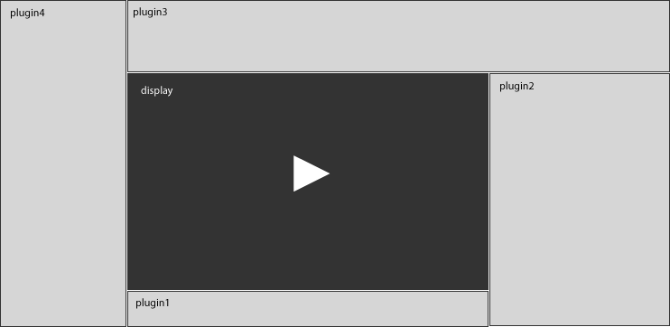

.. _layout:

Plugin Layout
=============

The JW Player resizes itself automatically to the dimensions of the Flash container in HTML. The resizing is managed like this:

 1. When the player detects a change to its container size, the display (the video screen) gets the entire canvas, minus the size of the controlbar and playlist.
 2. The player then places the playlist and controlbar, if they are enabled and positioned.
 3. Next, the player walks through every plugin to see if it has positioning options set.
 
  * The player will look for a *position* and *size* for each plugin and built-in player component.
  * For example, to set the *metaviewer* plugin to be visible to the left of the display and be 300 pixels wide, set the *metaviewer.position* option to **left**, and *metaviewer.size* to **300**.
  * The *pluginname.position* option can be set to **left**, **right**, **top**, **bottom** or **over**.
  
   * If *position* is **left** or **right**, *size* refers to the plugin's width
   * If *position* is **top** or **bottom**, *size* refers to the plugin's height
   
 4. Some components (such as the dock) have their position set to *over*. The player will then simply set the dimensions of this plugin to match those of the display.
 5. When all plugins have been positioned, the player notifies the plugins and components of their new size. It is up to each plugin to resize itself to the dimensions the player has determined for them.

Here is an intentionally exaggerated example string of flashvars of a player with four plugins that each have a position:

.. code-block:: text

	plugins=plugin1,plugin2,plugin3,plugin4
		&plugin1.position=bottom&plugin1.size=40
		&plugin2.position=right&plugin2.size=200
		&plugin3.position=top&plugin3.position=80
		&plugin4.position=left&plugin4.size=100

The corresponding player layout would then be:

