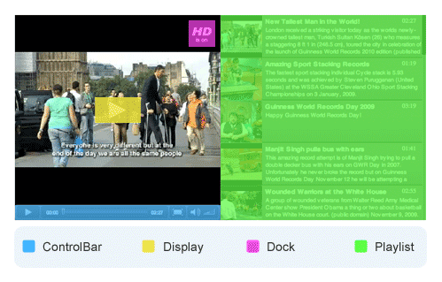
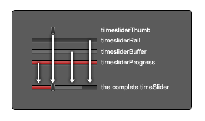
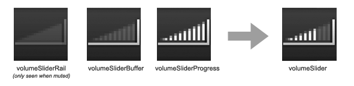
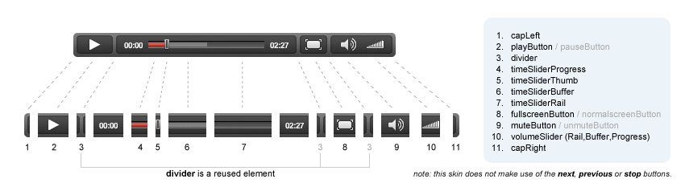
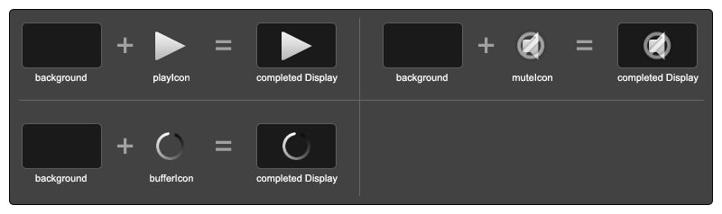
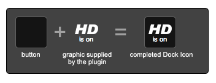
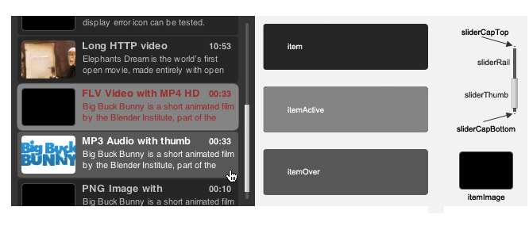

.. _skinning:

XML/PNG Skinning
================

With skins, you can customize the face of your JW player. You can alter the design of any of the player's four component parts -- ControlBar, Display, Dock and Playlist, as well as skinning-enabled plugins.  Before JW Player 5, it was only possible to build skins using Adobe Flash (which was difficult and error-prone).  Now, with JW Player 5, designers can build skins in their graphical editor of choice, and save the visual elements as bitmaps. This allows for rapid prototyping without the need to compile a swf file, and opens up skinning to designers who don't have Flash experience or software.

Supported Graphics Formats
--------------------------

JW Player 5 will accept most commonly used bitmap image formats including:

 * JPG
 * GIF (*Allows Transparency*)
 * PNG (8-Bit) (*Allows Transparency*)
 * PNG (24-Bit) (*Allows Transparency and Partial Transparency*)
 
Examples in this guide will use the PNG file format. It is the preferred format for creating slick skins due to its partial transparency support.

JW Player 5.2 and up support the use of SWF assets in the XML skinning format.  However, we recommend that designers restrict themselves to the bitmap formats above, since skins created using SWF assets will not compatible with the JW Player for HTML5.

.. note:: Animated gif files are not supported.

The XML Document
----------------

The XML (Extensible Markup Language) file, or document, contains all the settings for your skin -- the color settings for text and dock elements; margins and font-sizes for the ControlBar; and paths to images for every element in the skin.

A player skin consists of its own settings and its components. Here is an example of an XML document before the elements have been defined:

Basic XML Structure
^^^^^^^^^^^^^^^^^^^

.. code-block:: xml

   <?xml version="1.0"?>
   <skin version="1.1" name="SkinName" author="http://www.yoursite.com/">
      <components>
         <component name="controlbar">
            <settings>
               <setting name="..." value="..." />
            </setting>
            <layout>
               ...
            </layout>
            <element name="..." src="..." />
            <element name="..." src="..." />
            <element name="..." src="..." />
         </component>
         <component name="display">
            <settings>
               <setting name="..." value="..." />
            </setting>
            <element name="..." src="..." />
            <element name="..." src="..." />
            <element name="..." src="..." />
         </component>
         <component name="dock">
            <settings>
               <setting name="..." value="..." />
            </setting>
            <element name="..." src="..." />
            <element name="..." src="..." />
            <element name="..." src="..." />
         </component>
         <component name="playlist">
            <settings>
               <setting name="..." value="..." />
            </setting>
            <element name="..." src="..." />
            <element name="..." src="..." />
            <element name="..." src="..." />
         </component>
      </components>
   </skin>

Beginning Your XML Skin
^^^^^^^^^^^^^^^^^^^^^^^

The opening declaration of your XML document declares that it *IS* an XML document, and establishes that this is a JW Player skin.  Inside the skin element are two attributes:  *name* and *author*.

.. code-block:: xml

   <?xml version="1.0"?>
   <skin version="1.1" name="SkinName" author="http://www.yoursite.com/">
      
You can replace these with your skin's name and your website, or your own name if you'd prefer not to have your URL in the *author* attribute.

Linking to Images
^^^^^^^^^^^^^^^^^

Images must reside in a subdirectory corresponding to their parent container of the skin's folder.  For instance, Controlbar images should reside in the *controlbar* subdirectory.

Component sections
^^^^^^^^^^^^^^^^^^

The player's controls are broken into four components.  Each of these is defined in a **<component>** tag, and are all placed inside of the skin's **<components>** block.  The player controls are:

 * controlbar
 * display
 * dock
 * playlist 
 
In addition to player controls, it is also possible to define skinning elements for skinnable plugins as well.  These would be placed in another **<component>** tag, with the *name* attribute corresponding to the id of the plugin.

The Controlbar
--------------

The ControlBar component is used more than any of the other JW Player skin components. It controls video playback, shows you your point in time, toggles to full-screen mode and allows you to control the volume.

Controlbar XML Syntax
^^^^^^^^^^^^^^^^^^^^^

.. code-block:: xml

   <component name="controlbar">

      <settings>
         <setting name="backgroundcolor" value="0x000000"/>
         <setting name="margin" value="10" />
         <setting name="font" value="_sans" />
         <setting name="fontsize" value="10" />
         <setting name="fontcolor" value="0x000000" />
         <setting name="fontstyle" value="normal" />
         <setting name="fontweight" value="normal" />
         <setting name="buttoncolor" value="0xFFFFFF" />
      </settings>

      <elements>
         <element name="background" src="file.png" />
         <element name="capLeft" src="file.png" />
         <element name="capRight" src="file.png" />
         <element name="divider" src="file.png" />
         <element name="playButton" src="file.png" />
         <element name="playButtonOver" src="file.png" />   
         <element name="pauseButton" src="file.png" />
         <element name="pauseButtonOver" src="file.png" />
         <element name="timeSliderRail" src="file.png" />
         <element name="timeSliderBuffer" src="file.png" />
         <element name="timeSliderProgress" src="file.png" />
         <element name="timeSliderThumb" src="file.png" />
         <element name="fullscreenButton" src="file.png" />
         <element name="fullscreenButtonOver" src="file.png" />
         <element name="normalscreenButton" src="file.png" />
         <element name="normalscreenButtonOver" src="file.png" />
         <element name="muteButton" src="file.png" />
         <element name="muteButtonOver" src="file.png" />
         <element name="unmuteButton" src="file.png" />
         <element name="unmuteButtonOver" src="file.png" />
         <element name="volumeSliderRail" src="file.png" />
         <element name="volumeSliderBuffer" src="file.png" />
         <element name="volumeSliderProgress" src="file.png" />
         ...
      </elements>

      <layout>
         ...
      </layout>
   </component>

Controlbar Settings
^^^^^^^^^^^^^^^^^^^

In the example above, you will notice the bit of code containing the settings element for the ControlBar component. Here is a list of the Controlbar settings, along with their default values:

.. describe:: backgroundcolor (undefined)
   
   Color to display underneath the controlbar. If the controlbar elements are transparent or semi-transparent, this color will show beneath those elements.  If this is not set, the Flash stage will be visible beneath the controlbar.

.. describe:: margin (0)
   
   This is the margin which will wrap around the controlbar when the player is fullscreen mode, or when the player's *controlbar* setting is set to **over**.  The value is in pixels.

.. describe:: font (_sans)
   
   The font face for the Controlbar's text fields, **elapsed** and **duration**.  (*_sans*, *_serif*, *_typewriter*)

.. describe:: fontsize (10)
   
   The font size of the Controlbar's text fields.

.. describe:: fontweight (normal)
   
   The font weight for the Controlbar's text fields. (*normal*, *bold*)

.. describe:: fontstyle (normal)
   
   The font style for the Controlbar's text fields. (*normal*, *italic*)
   
.. describe:: fontcolor (undefined)
   
   The color for the Controlbar's text fields.

.. describe:: buttoncolor (undefined)
   
   The color for any custom Controlbar icons.
      
.. note: Color values are defined in a hexidecimal value for the color, just like in HTML/CSS. So, for instance, you can make a color red in HTML by assigning the corresponding HTML color code value of #FF0000. In this XML document, to make a color red you will input the value as 0xFF0000. As you can see, instead of # you use 0x.

Controlbar Elements
^^^^^^^^^^^^^^^^^^^

The controlbar contains a single background element:

.. describe:: background

   The background is a graphic which stretches horizontally to fit the width of the Controlbar.  *capLeft* and *capRight* (see below) are placed to the left and right of the background.

The Controlbar has a few elements which allow you to add space between elements. They are non-functioning bitmaps meant to give space to the right and left edges of the Controlbar.

.. describe:: capLeft
   
   The left cap graphic to your controlbar skin
   
.. describe:: capRight

   The right cap graphic to your controlbar skin
   
.. describe:: divider 

   A separator element between buttons and sliders.  *(this same element can appear multiple times)*

.. note:: JW Player 5.1 and below will fail to load without the **capLeft**, **capRight** and **volumeSlider** elements in the XML File.  This issue was resolved in version 5.2.
    
Next, there are the buttons. Controlbar buttons have two states. The **button** state is visible when the mouse is not hovering over the button.  The **buttonOver** state -- which should have the same dimensions as **button** -- is shown when the user hovers the mouse above the button. Here's a list of all buttons with their states:

* **playButton** / playButtonOver
* **pauseButton** / pauseButtonOver
* **prevButton** / prevButtonOver
* **nextButton** / nextButtonOver
* **stopButton** / stopButtonOver
* **fullscreenButton** / fullscreenButtonOver
* **normalscreenButton** / normalscreenButtonOver
* **muteButton** / muteButtonOver
* **unmuteButton** / unmuteButtonOver
* **blankButton** / blankButtonOver

The **blankButton** element is used when plugins insert additional buttons into the Controlbar.  This element should simply be a button background; the foreground element will be added by the plugins.
 
Certain buttons replace each other depending on the state of the JW Player. For instance, when a video is playing, the **playButton** is replaced by the **pauseButton** element. Toggle button pairs:

 * **playButton** / pauseButton
 * **fullscreenButton** / normalscreenButton
 * **muteButton** / unmuteButton

Next to the caps and buttons, there's the two sliders (for time and volume). The **timeSlider** is a unique block built using several elements stacked on top of each other. Of those elements, three of them automatically scale to a width based on the free space in the player. Those elements are: 

.. describe:: timeSliderRail

   the *background* graphic which serves as the frame for the timeSlider

.. describe:: timeSliderBuffer

   the file's buffer indicator
   
.. describe:: timeSliderProgress

   the file's progress indicator

With that in mind it is important to design your elements to gracefully scale horizontally.  The **timeSliderBuffer** and **timeSliderProgress** elements dynamically scale to indicate a percentage of progress of the total file length. 
Additional, non-scaling **timeSlider** elements are:

.. describe:: timeSliderThumb

   serves as a handle which can be dragged across the progress bar to allow the user to specify a seek position.
   
.. describe:: timeSliderCapLeft

   Left-hand end-cap, placed to the left of the **timeSliderRail** element.

.. describe:: timeSliderCapRight

   Right-hand end-cap, placed to the right of the **timeSliderRail** element.

The **volumeSlider** element is quite similar to the **timeSlider**, except that it does not scale automatically.  It will be as large as graphics you produce.  

.. describe:: volumeSliderRail

   the **background** graphic which serves as the frame for the volumeSlider

.. describe:: volumeSliderBuffer

   this shows the potential volume the slider can have.

.. describe:: volumeSliderProgress

   this is shows the current level at which the volumeSlider is set.

.. describe:: volumeSliderThumb

   the handle to slide the volume, also indicates the volume level.

.. describe:: volumeSliderCapLeft

   Left-hand end-cap, placed to the left of the **volumeSliderRail** element.

.. describe:: volumeSliderCapRight

   Right-hand end-cap, placed to the right of the **volumeSliderRail** element.

   the handle to slide the volume, also indicates the volume level.

.. note:: JW Player 5.1's skinning model will add 5 pixels of padding to each side of the **volumeSlider** if no end-caps are specified.  JW Player 5.1 and below will fail to load without the **volumeSliderRail** element in the XML file.
  
Two text fields can be laid out in the controlbar:

.. describe:: elapsed

   Amount of time elapsed since the start of the video (format: mm:ss)
   
.. describe:: duration

   Duration of the currently playing video (format: mm:ss)

Controlbar Layout
-----------------

The controlbar's components (*buttons*, *text fields*, *sliders* and *dividers*) are laid out according to a block of XML code in the Controlbar section.

Layout XML Syntax
^^^^^^^^^^^^^^^^^

Inside the controlbar's **<component>** block, you can insert an optional **<layout>** block which allows you to override the default controlbar layout.

.. code-block:: xml
   
   <layout>
      <group position="left">
         <button name="play" />
         <divider />
         <button name="prev" />
         <divider />
         <button name="next" />
         <divider />
         <button name="stop" />
         <divider />
         <text name="duration" />
         <divider />
      </group>
      <group position="center">
         <slider name="time" />
      </group>
      <group position="right">
         <text name="elapsed" />
         <divider />
         <button name="blank" />
         <divider />
         <button name="mute" />
         <slider name="volume" />
         <divider />
         <button name="fullscreen" />
      </group>
   </layout>

Layout Groups
^^^^^^^^^^^^^

The Controlbar's layout is made up of three groupings, *left*, *right* and *center*. 

* **Left**:Elements placed in the **<group position="left">** tag will be placed left to right and be left-aligned.
* **Center**: Elements placed in the **<group position="center">** tag will be placed between the *left* and *right* groups.  Furthermore, if the **timeSlider** element is placed here, it will be stretched to any space not assigned to other elements.
* **Right**: Elements placed in the **<group position="right">** tag will be placed left to right and be right-aligned.

Layout Elements
^^^^^^^^^^^^^^^

The **<group>** tag can contain the following elements:

.. describe:: <button name="..." />

   Used to place the Controlbar button elements described above.  For example, the **play** button would appear as **<button name="play" />**

.. describe:: <text name="..." />

   Used to place the Controlbar text elements, **elapsed** and **duration**.

.. describe:: <slider name="..." />

   Used to place the Controlbar slider elements, **timeSlider** and **volumeSlider**.

.. describe:: <divider />

   Used to place the **divider** element.  This tag can define two optional attributes (only one attribute may be used at a time):
   
* *element*: Allows an arbitrary element to be placed between other elements.  If no *element* or *width* attribute is set, the default **divider** graphic is used.  Example:

.. code-block:: xml

         <divider element="alternate_divider" />

* *width*: If this attribute is set, the specified number of pixels will be placed into the layout.  No graphical element will be used; the controlbar's **background** element will be visible.  Example:
   
.. code-block:: xml

         <divider width="10" />

Default Controlbar Layout
^^^^^^^^^^^^^^^^^^^^^^^^^

If no **<layout>** block is included in the skin, the player will use a default layout, based on which skin elements have been defined in the **<elements>** block.  The elements will be layed out in the following order:

 * capLeft
 * playButton/pauseButton
 * prevButton
 * nextButton
 * stopButton
 * divider
 * elapsedText
 * timeSliderCapLeft
 * timeSliderRail/timeSliderBuffer/timeSliderProgress/timeSliderThumb
 * timeSliderCapRight
 * durationText
 * divider (*reused element*)
 * blankButton
 * divider (*reused element*)
 * fullscreenButton/normalscreenButton
 * divider (*reused element*)
 * muteButton/unmuteButton
 * volumeSliderCapLeft
 * volumeSliderRail/volumeSliderBuffer/volumeSliderProgress/volumeSliderThumb
 * volumeSliderCapRight
 * capRight

The Display
-----------

The display largely consists of the buttons you see in the middle of the player. You see the familiar triangular **play** icon before the movie is playing, and also when you pause.  When the user has muted the player, the **Mute** icon appears.  Display Icons come in two parts: a global background element to every icon, and the icon itself, which is programmatically centered over the background layer.  All images must reside in the *display* subdirectory of the skin.

.. note:: By default, the **bufferIcon** will slowly rotate clockwise. There are settings to influence this rotation.

Display XML Syntax
^^^^^^^^^^^^^^^^^^

.. code-block:: xml

   <component name="display">
      <settings>
         <settings>
            <setting name="backgroundcolor" value="0x000000" />
            <setting name="bufferrotation" value="15" />
            <setting name="bufferinterval" value="100" />
         </settings>
      </settings>
      <elements>
         <element name="background" src="file.png" />
         <element name="playIcon" src="file.png" />
         <element name="playIconOver" src="file.png" />
         <element name="muteIcon" src="file.png" />
         <element name="muteIconOver" src="file.png" />
         <element name="bufferIcon" src="file.png" />
      </elements>
   </component>

Display Settings
^^^^^^^^^^^^^^^^

Here is a list of Display settings, along with their default values:

.. describe:: backgroundcolor (0x000000)
   
   This is the color of the player's display window, which appears behind any playing media.

.. describe:: bufferrotation (15)
   
   The number of degrees the buffer icon is rotated per rotation.  A negative value will result in the buffer rotating counter-clockwise.

.. describe:: bufferinterval (100)
   
   The amount of time, in milliseconds between each buffer icon rotation.

Display Elements
^^^^^^^^^^^^^^^^

The following elements are available for the Display.  All of the elements are optional, and will be excluded from the player if they are not

.. describe:: background

   The background is a graphic which is placed behind the display icons, and is centered inside the Display. 

.. describe:: playIcon

   This element is displayed when the player is paused or idle.
   
.. describe:: playIconOver

   This element replaces the *playIcon* element when the user hovers the mouse over it.
   
.. describe:: muteIcon

   This element is displayed when the player is muted. 

.. describe:: muteIconOver

   This element replaces the *muteIcon* element when the user hovers the mouse over it.

.. describe:: bufferIcon

   This element is displayed when the player is in a buffering state.  If *bufferIcon* is a static image, it will be rotated around its center.  If it is an animated SWF file, it will simply be placed in the center of the display.  

The Dock
--------

Dock Icons elements sit at the top right corner of your player and can be both informative or functional.  For instance, if you've installed the HD plugin, once you've toggled High Definition Playback to ON, a small HD Dock Icon will appear in top corner of your player, letting you know you're watching in HD.

 
Dock XML Syntax
^^^^^^^^^^^^^^^

.. code-block:: xml

   <component name="dock">
      <settings>
         <setting name="fontcolor" value="0x000000" />
      </settings>
      <elements>
         <element name="button" src="file.png" />
         <element name="buttonOver" src="file.png" />
      </elements>
   </component>

Dock Settings
^^^^^^^^^^^^^

The dock's *settings* block contains only one setting:

.. describe:: fontcolor (0x000000)
   
   The color for the Dock buttons' text fields.

Dock elements
^^^^^^^^^^^^^

The Dock only has two elements:

.. describe:: button 

   The background image of a dock button when the mouse is not rolled over it.

.. describe:: buttonOver 

   The background image of a dock button when the mouse is rolled over it. Is not required.

The Playlist
------------

There are two main Playlist skin elements; Playlist Items, and the Playlist Slider.  Item graphics scale horizontally and are placed behind the description/thumbnail of videos in your playlist.  The slider is a vertical scrollbar rail and handle (thumb), with optional top and bottom endcaps.

.. note::
      
   When a playlist button is less than 240px wide and/or less than 40 pixels high, its image and description are automatically hidden, allowing for a *light* playlist to be displayed.

Playlist XML Syntax
^^^^^^^^^^^^^^^^^^^

.. code-block:: xml

   <component name="playlist">
      <settings>
         <setting name="fontcolor" value="0x999999" />
         <setting name="overcolor" value="0xFFFFFF" />
         <setting name="activecolor" value="0x990000" />
         <setting name="backgroundcolor" value="0x000000"/>
         <setting name="font" value="_sans" />
         <setting name="fontsize" value="12" />
         <setting name="fontweight" value="normal" />
         <setting name="fontstyle" value="normal" />
      </settings>
   
      <elements>
         <element name="background" src="background.png" />
         <element name="item" src="item.png" />
         <element name="itemOver" src="itemOver.png" />
         <element name="itemActive" src="itemActive.png" />
         <element name="itemImage" src="itemImage.png" />
         <element name="sliderRail" src="sliderRail.png" />
         <element name="sliderThumb" src="sliderThumb.png" />
         <element name="sliderCapTop" src="sliderCapTop.png" />
         <element name="sliderCapBottom" src="sliderCapBottom.png" />
      </elements>
   </component>

Playlist Settings
^^^^^^^^^^^^^^^^^

Here is a list of the settings that can be placed in the playlist's **<settings>** block, along with their default values:

.. describe:: fontcolor (undefined)
   
   The color for the playlist's text fields.

.. describe:: overcolor (undefined)
   
   The color for the playlist item's text fields when the mouse is hovering over an item.

.. describe:: activecolor (undefined)
   
   The color for the playlist item's text fields when that item is the currently active item.

.. describe:: backgroundcolor (undefined)
   
   The playlist's background color.

.. describe:: font (_sans)
   
   Font used for the playlist's text fields (*_sans*, *_serif*, *_typewriter*)

.. describe:: fontsize (undefined)
   
   Font size for the playlist's text fields.  By default, the playlist item's title has a fontsize of 13 pixels; the rest of the fields are 11 pixels.  If **fontsize** is set, all text fields will have the same font size.

.. describe:: fontstyle (normal)
   
   Can be used to set the font style for the playlist's text fields (*normal*, *italic*)

.. describe:: fontweight (normal)
   
   Can be used to set the font weight for the playlist's text fields (*normal*, *bold*)

Playlist elements
^^^^^^^^^^^^^^^^^

The following Playlist elements are available:

.. describe:: background

   The *background* element serves as the default background of the playlist if there are fewer elements than the height of the playlist. It stretches in both the X and Y direction.

.. describe:: item

   Background graphic for each playlist item.  Stretch to the width of the playlist, minus the slider width (if necessary).

.. describe:: itemOver

   Over state for **item**.  Replaces **item** whenever the user mouses over.

.. describe:: itemImage

   Image placeholder.  This element is visible when the playlist item does not have an image associated with it.  If the playlist item image is present, **itemImage**'s shape serves as a mask around the playlist item image.  If the playlist item image has any transparency, **itemImage** will be visible behind it.
   
.. describe:: itemActive

   Active state for **item**.  Replaces **item** whenever the corresponding playlist item is the currently playing/loaded playlist item.
   
.. describe:: sliderRail

   Background of the vertical slider.  When the playlist's slider is visible, **sliderRail** is stretched to the height of the playlist, minus the height of any end caps.
   
.. describe:: sliderThumb

   Draggable thumb for the vertical slider.  This element is stretched vertically, and is proportional to the visible area of the playlist versus its total size.  For example, if 50% of the playlist items are currently visible in the playlist, the thumb will be 50% of the height of the playlist.
   
.. describe:: sliderCapTop

   Top end cap for the playlist slider.  Placed above **sliderRail**.

.. describe:: sliderCapBottom

   Bottom end cap for the playlist slider.  Placed below **sliderRail**.

Plugins
-------

Some plugins allow their elements to be skinned as well.  If so, you can place those elements directly in your skin, the same way you skin built-in player components.  The *name* attribute must match the plugin's *id*.  All plugin elements must be placed in a folder whose name also matches the plugin's *id*.

In the following example, the skin defines the HD plugin's two skinnable elements:

.. code-block:: xml

   <component name="hd">
      <elements>
         <element name="dockIcon" src="dockIcon.png" />
         <element name="controlbarIcon" src="controlbarIcon.png" />
      </elements>
   </component>

Packaging your Skin
-------------------

Packaging your skin is as easy as zipping the skin XML file along with the subfolders containing the component graphics.

Zip File Structure
^^^^^^^^^^^^^^^^^^

The XML file should named the same as the skin itself.  For example, a skin called *myskin* would contain an XML file called *myskin.xml*, and would be zipped into *myskin.zip*.  All images belong in their corresponding folders and reside on the same level as the XML file.

 * *skin_name*.xml
 * controlbar (folder with images)
 * display (folder with images)
 * dock (folder with images)
 * playlist (folder with images)

Once you have zipped everything up, using a skin is a matter of:

* Uploading the skin to your server
* Setting the :ref:`skin option <options>` in your player's :ref:`embed code <embedding>` to the URL of the ZIP file.

Example skins
^^^^^^^^^^^^^

A number of example skins can be freely downloaded from our `addons repository <http://www.longtailvideo.com/addons/>`_. Feel free to tweak any of these skins to make them fit your site design.
